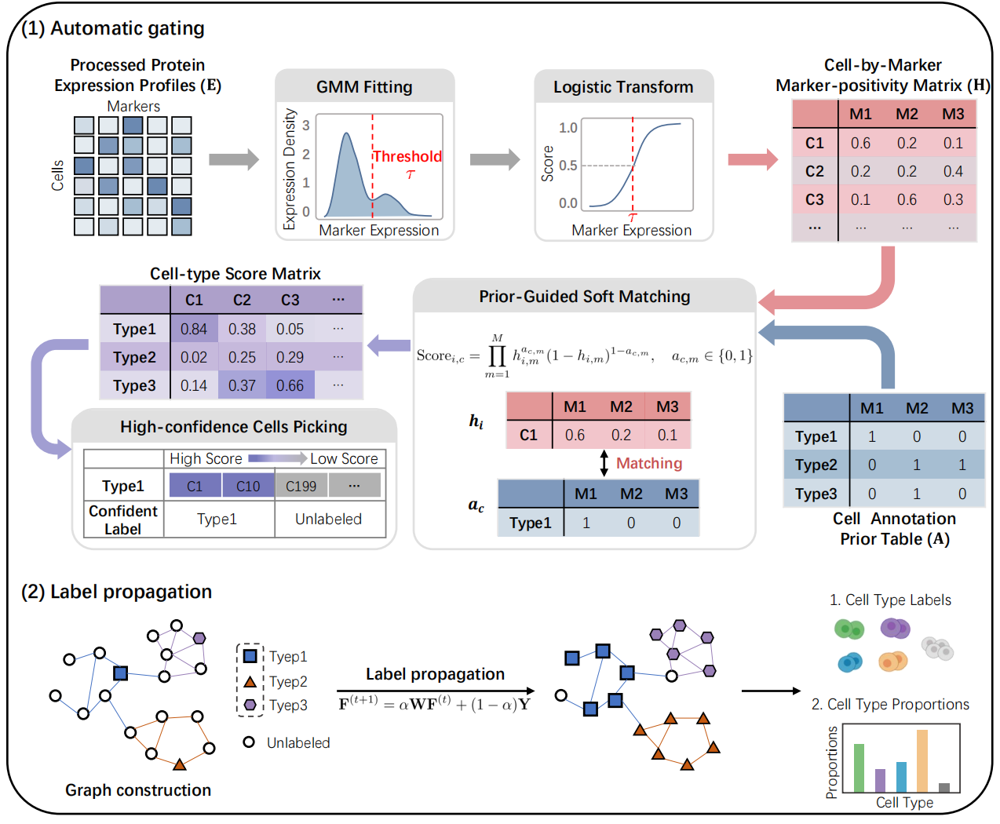
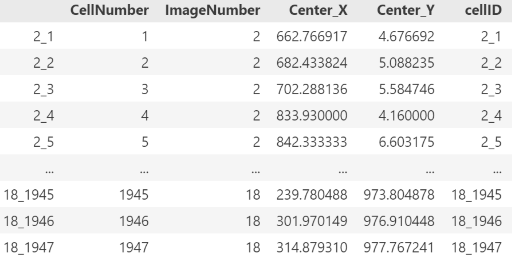

# PASCAL
PASCAL (**P**ropagation **A**lgorithm for **S**emi-supervised **C**ell-type **A**ssignment and **L**abeling) is a framework that leverages cell-cell similarity and graph-based label propagation for accurate and generalizable automatic cell-type annotation.



## Installation
### Dependencies
```
Python >= 3.8
```

a. Set up a python environment (conda virtual environment is recommended).

```shell
conda create -n pascal python=3.8
git clone <REPO_URL>
cd PASCAL
conda activate pascal
```

b. Install required python packages.

```shell
pip install -r requirements.txt
```

## Data preparation and preprocessing

PASCAL requires **two inputs**:

1. **A preprocessed single-cell expression matrix** (stored as an AnnData `.h5ad` file).
2. **A prior annotation table** (stored as a `.csv` file).

---
### (1) Expression matrix

PASCAL uses a preprocessed single-cell expression matrix, where rows correspond to cells and columns correspond to measured protein markers. Each entry represents the expression intensity of a marker in a cell. This matrix should be stored in an **AnnData** object and saved as a **`.h5ad`** file with the following structure:

- `AnnData.X`: marker expression matrix (cells × markers)
- `AnnData.var`: marker metadata (at minimum, marker names in `AnnData.var_names`)
- `AnnData.obs`: cell metadata (e.g., cell ID, batch, etc.)

Below is an example of **cell metadata** stored in `AnnData.obs`. Rows correspond to the same cells as those in `AnnData.X`, and columns provide additional information about each cell.



**Creating the `.h5ad` input (optional)**

If you do not already have an AnnData `.h5ad` file, you can generate one using the provided script `create_h5ad.py`, which supports marker expression inputs in **`.fcs`** or **`.csv`** format (together with a cell metadata `.csv`).

```shell
python create_h5ad.py -data ./example/IMC_data.fcs -meta ./example/IMC_meta_data.csv -outdir ./example/
```
- `data`: Path to the marker expression data file.
- `meta`: Path to the cell metadata file.
- `outdir`: Path to store the output `.h5ad` file.
---

### (2) Prior annotation table

PASCAL also requires a **prior annotation table** curated from biological knowledge. This table specifies, for each cell type, the expected **high/low expression patterns** of a selected marker set, where `1` indicates an expected **high** marker and `0` indicates an expected **low** marker. Example prior tables are provided in `gating_strategy/`. The table should include a *negative* cell type to represent cells that do not match any defining-marker pattern.


## Usage
PASCAL provides a single entry point script: `run.py`. To run the pipeline, you only need to specify the dataset identifier via `-data`.

```shell
python run.py -data <DATASET_ID>
```
**Arguments**

- `data`: Input dataset identifier. This identifier must be registered in `config.py`:
    
    - `TEST_DATA_PATHS[DATASET_ID]`: path to the input .h5ad file
    - `MARKER_PRIOR_PATHS[DATASET_ID]`: path to the corresponding marker prior table

**Outputs**

Results are saved into `params.results_path` (configured in config.py):

- `*_th{unknown_thres}_result.csv`: predicted labels

- `*_th{unknown_thres}_unnorm_probs.csv`: unnormalized class scores for each cell